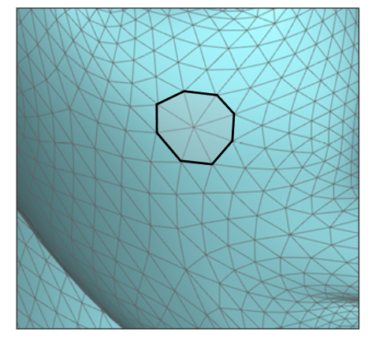
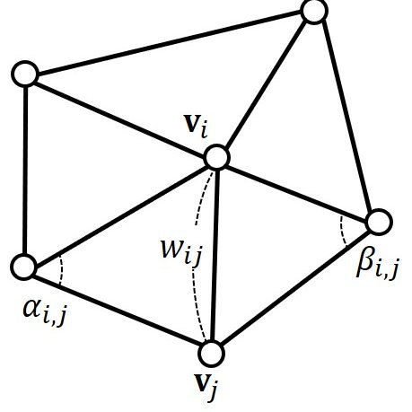
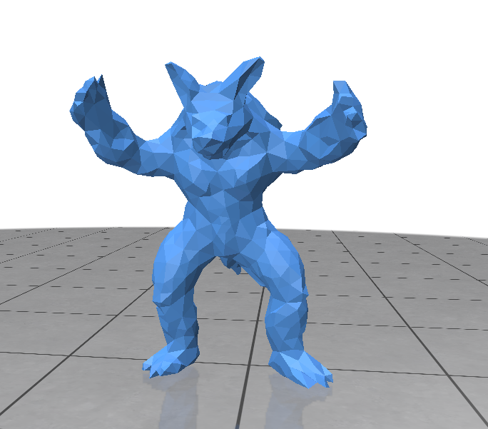
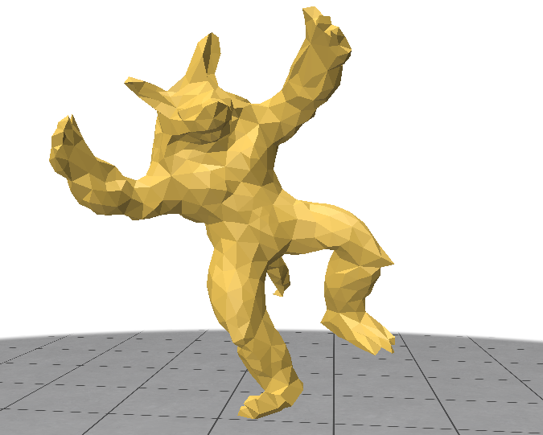
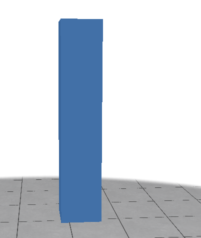
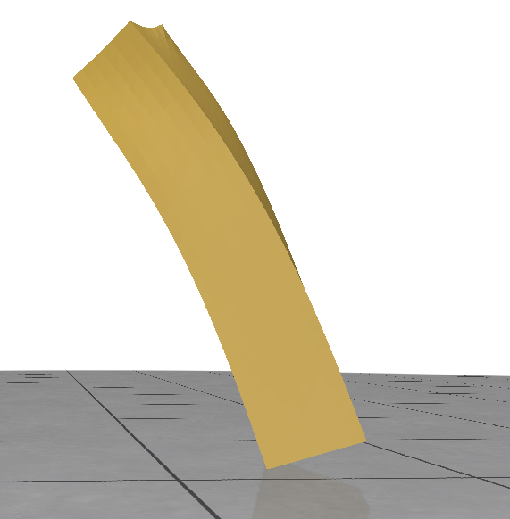

# Proj602_As_Rigid_As_Possible

### Projet réalisé par Romain Pajean & Florian Dufaure dans le cadre d'un projet de recherche tuteuré ([lien](https://www.lama.univ-savoie.fr/mediawiki/index.php/PROJ602_CMI_:_Projet_de_recherche_tuteur%C3%A9))
--- 
## Le but de notre code
Le but de ce projet était de pouvoir éditer des surfaces triangulées d'une figure 3D, afin de la déformer en utilisant la méthode **As-Rigid-As-Possible** décrit dans le [document suivant](https://www.lama.univ-savoie.fr/pagesmembres/lachaud/Cours/VISI601/Tests/doc/html/arap_web.pdf).

Cette méthode de déformation permet de garder une cohérence dans la structure générale de la figure déformée.

Notre code a donc suivie la méthode décrite dans le document ci-dessus :

La première étape de notre code est de récupérer les differents sommets et surfaces triangulées du fichier .off, en entrée, décrivant la structure d'un modèle 3D.

Ensuite nous divisons notre figure en cellules. Une cellule est un sommet avec ses voisins qui lui sont liés :

Nous calculons le poids des arêtes interne de chaque cellule en utilisant le poids cotangent.




Une fois cela fait, nous appliquons les différentes contraintes en entrée qui sont :
- Les sommets fixés
- Les sommets à déplacer

Dans le calcul de la structure déformée, nous utilisons des transformations rigides. Une transformation rigide est une translation et rotation d'une cellule.


Enfin pour obtenir la structure modifiée, nous calculons les nouvelles positions des sommets itérativement en utilisant une stratégie de minimisation alternée. Nous calculons les futures positions des sommets en appliquant des transformations rigides qui minimise l'énergie.

Puis avec ces nouveaux points nous calculons les nouvelles transformations rigides à appliquer, et ainsi de suite...

### Points non réalisé / Améliorations possible :
- Dans notre application nous n'avons pas réussi à appliquer les contraintes des sommets fixes.
- Faire sorte que l'algorithme s'arrête à un certein seuil de minimisation au lieu d'un nombre fixe d'itérations.
- Pouvoir selectioner les sommets à fixer et à déplacer sur la figure plus facilement.
- Pouvoir déplacer les points de la figure directement à la souris.
- Optimiser le temps de calcul.
---
## Installation

Notre projet est écrit en **python** et pour l'exécuter vous avez besoin des librairies suivantes : 
```
- Numpy
- Polyscope
- Mpmath
```

Pour les installer il faut exécuter la commande suivante dans un terminal

```
python3 -m pip install numpy polyscope mpmath
```
---
## Execution

Pour exécuter notre programme il suffit de lancer le fichier **main.py** avec la commande 
```
./main.py
```
dans un terminal à la racine du projet

---
## Illustrations

Voici un exemple avec un tatou en 3d





Un exemple avec une bar en 3d




---
## Différents paramètres

Les différents paramètres d'entrés de notre programme sont : 
- Le modèle 3D choisi
    - Dans le fichier **main.py** : openOffFile("chemin vers votre fichier .off")
- Les points fixés
    - Dans le fichier **main.py** : premier paramètre de Arap.appliquer_contrainte (la liste des indices des sommets a fixer)
- Les points qui vont être déplacé 
    - Dans le fichier **main.py** : deuxième paramètre de Arap.appliquer_contrainte (la liste des indices des sommets à déplacer)